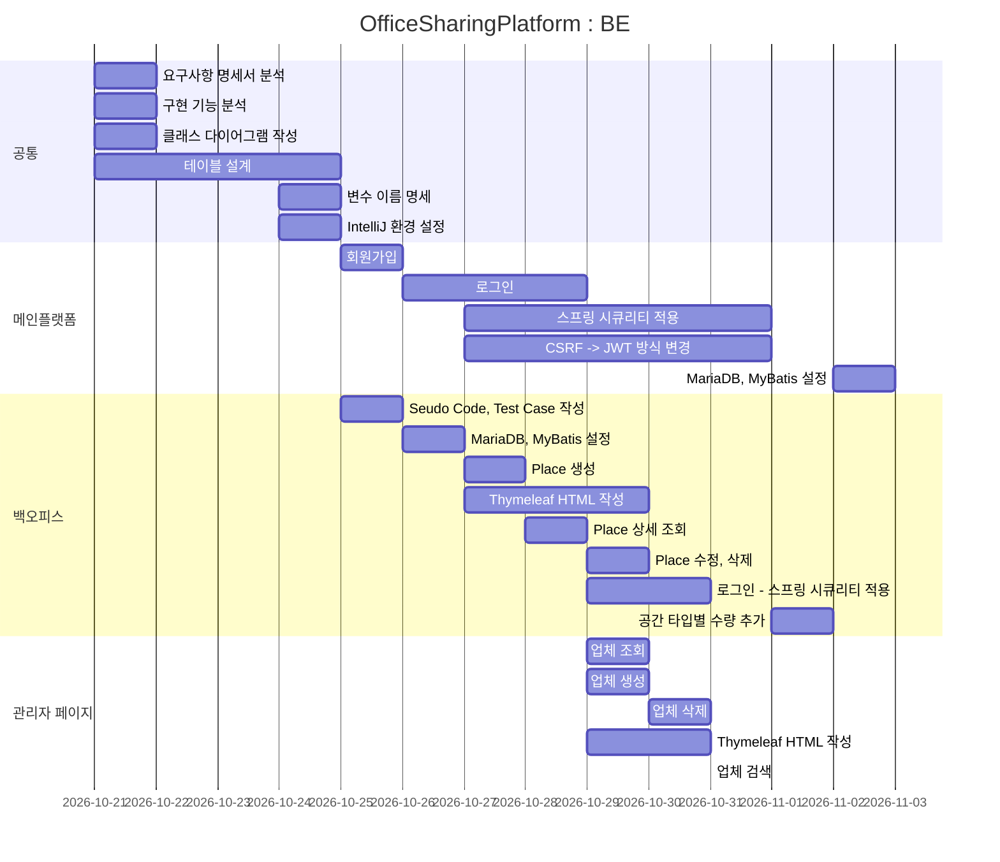

# OfficeSharingPlatformTest

## 개발을 위한 테스트 레포지토리 (like 테스트 서버)

### 기능 개발 : OfficeSharingPlatformTest

### 개발 완료 : OfficeSharingPlatform

```mermaid
gantt
dateFormat MM-DD
title OfficeSharingPlatform : BE

    section 공통
    요구사항 명세서 분석      :chap1, 10-21, 1d
    구현 기능 분석          :chap2, 10-21, 1d
    클래스 다이어그램 작성    :chap3, 10-21, 1d 
    테이블 설계            :chap4, 10-21, 4d
    변수 이름 명세          :chap5, 10-24, 1d
    IntelliJ 환경 설정     :chap6, 10-24, 1d

    section 메인플랫폼
    회원가입                :chap1, 10-25, 1d
    로그인                 :chap2, 10-26, 3d
    스프링 시큐리티 적용       :chap3, 10-27, 11-01
    CSRF -> JWT 방식 변경   :chap4, 10-27, 11-01
    MariaDB, MyBatis 설정 :chap5, 11-02, 1d
    
    section 백오피스
    Seudo Code, Test Case 작성    :chap1, 10-25, 1d
    MariaDB, MyBatis 설정         :chap2, 10-26, 1d
    Place 생성                    :chap3, 10-27, 1d
    Thymeleaf HTML 작성           :chap4, 10-27, 10-30
    Place 상세 조회                :chap5, 10-28, 1d
    Place 수정, 삭제               :chap6, 10-29, 1d
    로그인 - 스프링 시큐리티 적용       :chap7, 10-29, 10-31
    공간 타입별 수량 추가             :chap8, 11-01, 11-02
    
    section 관리자 페이지
    업체 조회              :chap1, 10-29, 1d
    업체 생성              :chap2, 10-29, 1d
    업체 삭제              :chap3, 10-30, 1d
    Thymeleaf HTML 작성   :chap4, 10-29, 10-31
    업체 검색              :chap5, 10-31, 10-31
    
```