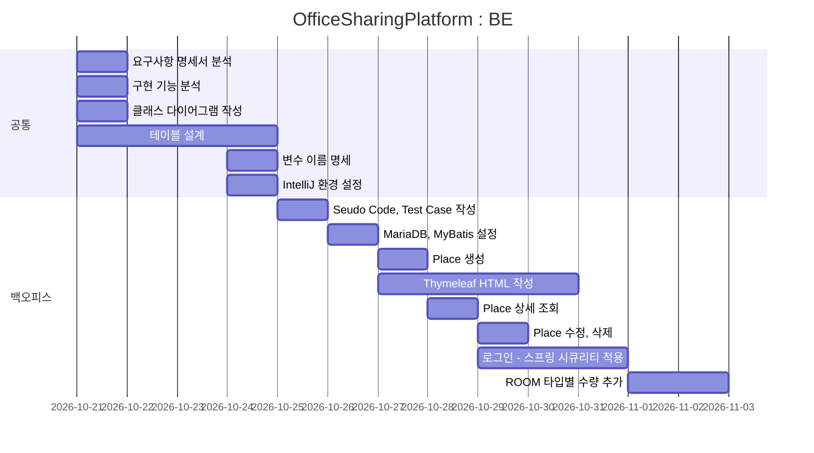

# BackOfficeTest

```mermaid
gantt
dateFormat MM-DD
title OfficeSharingPlatform : BE

    section 공통
    요구사항 명세서 분석      :chap1, 10-21, 1d
    구현 기능 분석          :chap2, 10-21, 1d
    클래스 다이어그램 작성    :chap3, 10-21, 1d 
    테이블 설계            :chap4, 10-21, 4d
    변수 이름 명세          :chap5, 10-24, 1d
    IntelliJ 환경 설정     :chap6, 10-24, 1d
    
    section 백오피스
    Seudo Code, Test Case 작성    :chap1, 10-25, 1d
    MariaDB, MyBatis 설정         :chap2, 10-26, 1d
    Place 생성                    :chap3, 10-27, 1d
    Thymeleaf HTML 작성           :chap4, 10-27, 4d
    Place 상세 조회                :chap5, 10-28, 1d
    Place 수정, 삭제               :chap6, 10-29, 1d
    로그인 - 스프링 시큐리티 적용       :chap7, 10-29, 3d
    ROOM 타입별 수량 추가            :chap8, 11-01, 2d
```