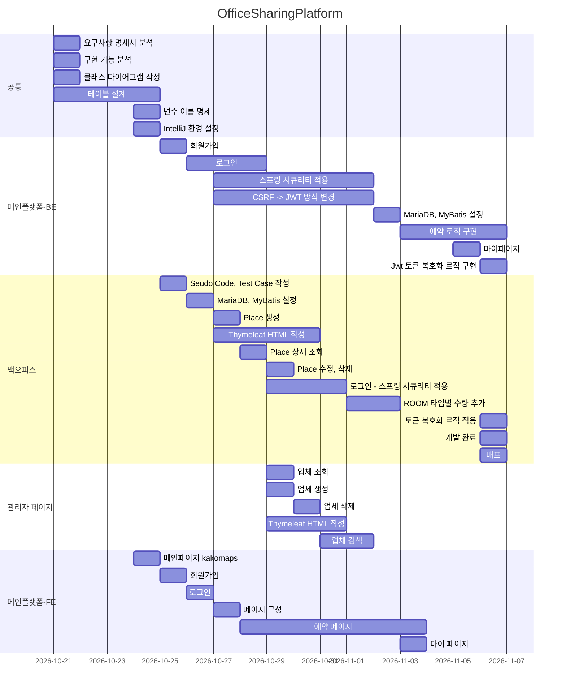

# OfficeSharingPlatform

## Repository for 2nd Semi Project

## DEVELOP : 개발 DIRECTORY
## RELEASE : 최종 DIRECTORY
## DOCUMENT : 문서 DIRECTORY

### BE : 오령기, 최한성, 이동훈

### FE : 이찬형

### 개발 일정

```mermaid
gantt
dateFormat MM-DD
title OfficeSharingPlatform

    section 공통
    요구사항 명세서 분석      :chap1, 10-21, 1d
    구현 기능 분석          :chap2, 10-21, 1d
    클래스 다이어그램 작성    :chap3, 10-21, 1d
    테이블 설계            :chap4, 10-21, 4d
    변수 이름 명세          :chap5, 10-24, 1d
    IntelliJ 환경 설정     :chap6, 10-24, 1d

    section 메인플랫폼-BE
    회원가입                :chap1, 10-25, 1d
    로그인                 :chap2, 10-26, 3d
    스프링 시큐리티 적용       :chap3, 10-27, 6d
    CSRF -> JWT 방식 변경   :chap4, 10-27, 6d
    MariaDB, MyBatis 설정  :chap5, 11-02, 1d
    예약 로직 구현           :chap6, 11-03, 4d
    마이페이지               :chap7, 11-05, 1d
    Jwt 토큰 복호화 로직 구현  :chap8, 11-06, 1d

    section 백오피스
    Seudo Code, Test Case 작성    :chap1, 10-25, 1d
    MariaDB, MyBatis 설정         :chap2, 10-26, 1d
    Place 생성                    :chap3, 10-27, 1d
    Thymeleaf HTML 작성           :chap4, 10-27, 4d
    Place 상세 조회                :chap5, 10-28, 1d
    Place 수정, 삭제               :chap6, 10-29, 1d
    로그인 - 스프링 시큐리티 적용       :chap7, 10-29, 3d
    ROOM 타입별 수량 추가            :chap8, 11-01, 2d
    토큰 복호화 로직 적용             :chap9, 11-06, 1d
    개발 완료                      :chap10, 11-06, 1d
    배포                          :chap11, 11-06, 1d

    section 관리자 페이지
    업체 조회              :chap1, 10-29, 1d
    업체 생성              :chap2, 10-29, 1d
    업체 삭제              :chap3, 10-30, 1d
    Thymeleaf HTML 작성   :chap4, 10-29, 3d
    업체 검색              :chap5, 10-31, 2d

    section 메인플랫폼-FE
    메인페이지 kakomaps     : chap1, 10-24, 1d
    회원가입                :chap2, 10-25, 1d
    로그인                 :chap3, 10-26, 1d
    페이지 구성            :chap4, 10-27, 1d
    예약 페이지            :chap5, 10-28, 7d
    마이 페이지            :chap6, 11-03, 1d

```
