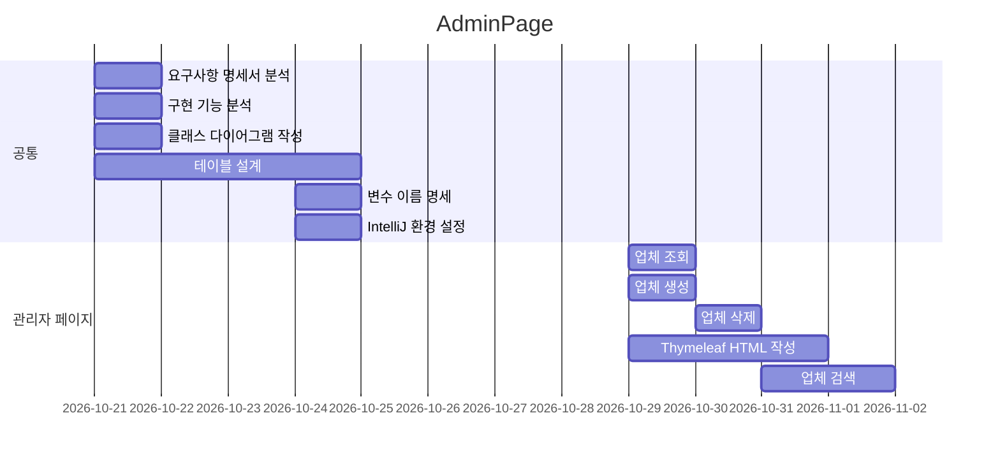

# AdminPage

## Repository for Release Project

### Collaborator

#### BE : 오령기, 최한성, 이동훈

#### FE : 이찬형

### 개발 일정

```mermaid
gantt
dateFormat MM-DD
title AdminPage

    section 공통
    요구사항 명세서 분석      :chap1, 10-21, 1d
    구현 기능 분석          :chap2, 10-21, 1d
    클래스 다이어그램 작성    :chap3, 10-21, 1d 
    테이블 설계            :chap4, 10-21, 4d
    변수 이름 명세          :chap5, 10-24, 1d
    IntelliJ 환경 설정     :chap6, 10-24, 1d
    
    section 관리자 페이지
    업체 조회              :chap1, 10-29, 1d
    업체 생성              :chap2, 10-29, 1d
    업체 삭제              :chap3, 10-30, 1d
    Thymeleaf HTML 작성   :chap4, 10-29, 3d
    업체 검색              :chap5, 10-31, 2d
    
```